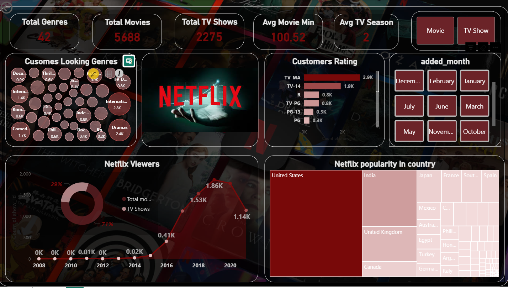

# 📊 Netflix Data Analysis Dashboard

## 📌 Overview

This project analyzes Netflix dataset to uncover insights about content distribution, genres, ratings, and country-wise trends using Python and Power BI.

---

## 📊 Dashboard Preview

  

---

## 🛠️ Tools Used

* Python (Pandas)
* Power BI
* DAX

---

## 🚀 Key Highlights

* Built an interactive Power BI dashboard
* Cleaned and transformed data using Python
* Applied DAX for key business calculations
* Created dynamic filters for better analysis

---

## 🔍 Key Insights

* Content increased rapidly after 2015
* Movies are more than TV Shows
* USA produces the highest content
* Drama & International genres are most popular

---

## 💼 Business Impact

* Helps identify top-performing content
* Supports data-driven decision-making
* Provides country-wise performance insights

---

## 📬 Contact

**Md Moeed**
📧 [mdmoeed72@gmail.com](mailto:mdmoeed72@gmail.com)

⭐ If you like this project, give it a star!
